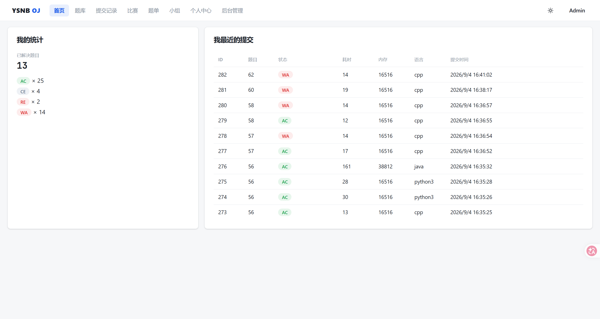
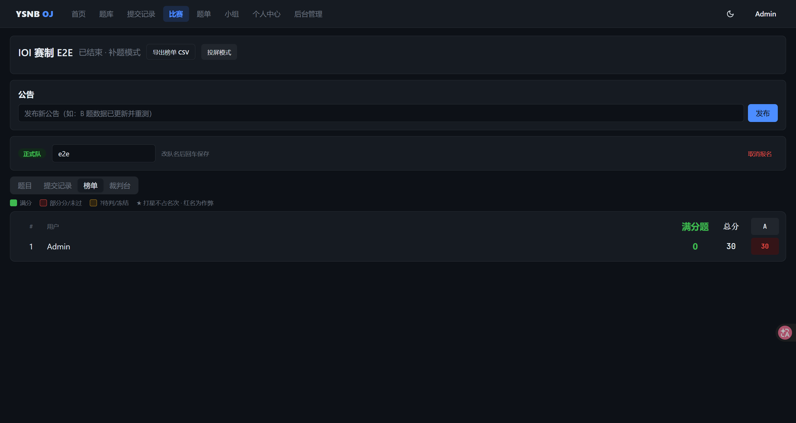

<div align="center">

# YSNB OJ

**You Submit, Never Be rejected.**

A self-hosted competitive programming judge with a from-scratch sandbox.

[](LICENSE)
[](https://github.com/Asanagl/ysnb-oj/releases)
[](https://asanagl.github.io/ysnb-oj/en/)

[Documentation](https://asanagl.github.io/ysnb-oj/en/) · [简体中文](README_ZH.md) · [Report an issue](https://github.com/Asanagl/ysnb-oj/issues)



</div>

---

## Introduction

YSNB OJ is an online judge built from scratch for a campus ACM team, now
open source. The judging sandbox is written from scratch — cgroup v2,
namespaces and a seccomp cBPF allowlist, with the whole escape-test suite
running in CI-like conditions — instead of wrapping go-judge or forking an
existing judge. The rest of the stack is deliberately boring: Go 1.27 +
Gin + GORM on the backend, Vue 3 + Tailwind CSS v4 + shadcn-vue on the
frontend, PostgreSQL and Redis behind it.

Everything a training team needs ships in the box:

- ACM and IOI contest modes, team contests, score freeze and reveal,
  practice mode after the contest
- SPJ checkers and interactive problems, in sandboxed bidirectional pipes
- Problem packages: native format plus DOMjudge and Hydro import
- Problem lists, groups with shared lists, per-user 365-day heatmap
- Practice sync from Codeforces / Luogu / AtCoder / Nowcoder
- Live judging status over WebSocket: the submission page advances from
  queued to verdict in place, with per-case dots lighting up as cases pass
- A public read-only API with API keys and a cph bridge (Competitive
  Companion / VSCode cph)
- Multi-judge over gRPC, a maintenance CLI for lockout rescue, structured
  logs with an in-admin log viewer

Measured on a 2C4G cloud box (API and judge co-located): a burst of 64
submissions all AC, API latency under 4 ms, standings under 6.3 ms, six E2E
suites green.

## Quick start

Prerequisites: a Linux server (Ubuntu 22.04+ / Debian 12+), Docker ≥ 24,
cgroup v2 enabled (`stat -fc %T /sys/fs/cgroup` prints `cgroup2fs`).

```bash
# 1) Build the frontend on your dev machine, sync the repo (with frontend/dist/) to the server
cd frontend && npm ci && npm run build

# 2) On the server, as root
bash deploy/one-click.sh
```

The script generates `.env` with fresh secrets, starts postgres / redis /
api / web via Docker Compose, waits for the API, walks through the judge
self-test, installs a daily backup cron with a monthly restore drill, and
prints the site URL and initial admin password. Idempotent; safe to re-run.

A [systemd bare-metal route](docs/en/operations/deploy) without Docker is
documented as well. The judge binary is Linux-only (the sandbox needs
cgroup v2 and namespaces) and never runs on dev machines — see
[local development](docs/en/development/handover) for the frontend + remote
backend workflow.

## Documentation

Full documentation lives at <https://asanagl.github.io/ysnb-oj/en/>
([中文版](https://asanagl.github.io/ysnb-oj/)): deployment, operations
runbook, user and admin guides, the judging pipeline and sandbox internals,
and the public API reference.

## Security

Contestant code is fully untrusted and the sandbox treats it that way:
read-only root with tmpfs overlays on sensitive paths, dropped privileges,
cgroup v2 limits, rlimits, a wall-clock watchdog and a seccomp cBPF
allowlist (default SIGKILL) — no network inside the judge namespace. An
escape test suite (path traversal, /proc probing, fork bombs, host writes,
networking attempts) runs as a routine test asset, and the cBPF program has
an exhaustive interpreter test. **Full judging test data never leaves the
judge through any public channel.**

The audit trail lives in [docs/archive/security-audit.md](docs/archive/security-audit.md).

## Community

Questions, feedback or just want to see how others use it? Join the QQ
group: **958494161**. You can also reach the maintainer directly:
QQ **384538983**.

## Contributing

Issues and pull requests are welcome — see
[CONTRIBUTING.md](CONTRIBUTING.md).

## License

[MIT](LICENSE) © Asanagl
